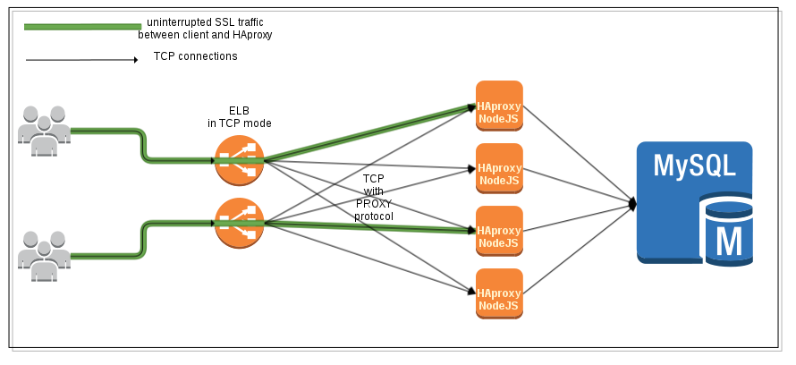

==============================================
HAProxy termination in AWS: technical overview
==============================================

.. |date| date::
.. |time| date:: %H:%M

:Revision: Last updated on |date| at |time|.
:Author: Julien Vehent <julien@linuxwall.info>

.. sectnum::

.. contents:: Table of Contents

This document explains how HAProxy and Elastic Load Balancer can be used in
Amazon Web Services to provide performant and secure HTTPS termination. The goal
is to provide the following features:

* DDoS Protection: we use HAProxy to mitigate low to medium DDoS attacks, with
  sane limits and custom blacklist.

* Application firewall:  we perform a first level of filtering in HAProxy, that
  protects NodeJS against all sorts of attack, known and to come. This will be done
  by inserting a set of regexes in HAProxy ACLs, that get updated when the
  application routes are updated. Note that managing these ACLs will not impact
  uptime, or require redeployment.

* SSL/TLS: ELBs support the PROXY protocol, and so does HAProxy, which allows us
  to proxy the tcp connection to HAProxy. It gives us better TLS, backed by
  OpenSSL, at the cost of managing the TLS keys on the HAProxy instances.

* Logging: ELBs have no support for logging. HAProxy, however, has excellent
  logging for TCP, SSL and HTTPS. We leverage the flexibility of HAProxy's logging
  to improve our DDoS detection capabilities. We also want to uniquely identify
  requests in HAProxy and NodeJS, and correlate events, using a `unique-id`.

Below is our target setup:

Building process
----------------
The following script builds haproxy with statically linked OpenSSL and PCRE
support.

.. include:: build_static_haproxy.sh
	:code: bash

PROXY protocol between ELB and HAProxy
--------------------------------------

This configuration uses an Elastic Load Balancer in TCP mode, with PROXY
protocol enabled. The PROXY protocol adds a string at the beginning of the TCP
payload that is passed to the backend. This string contains the IP of the client
that connected to the ELB, which allows HAProxy to feed its internal state with
this information, and act as if it had a direct TCP connection to the client.

For more information on the PROXY protocol, see
http://haproxy.1wt.eu/download/1.5/doc/proxy-protocol.txt

First, we need to create an ELB, and enable a TCP listener on port 443 that
supports the PROXY protocol. The ELB will not decipher the SSL, but instead pass
the entire TCP payload down to Haproxy.

ELB Configuration
~~~~~~~~~~~~~~~~~
PROXY protocol support must be enabled on the ELB.

.. code:: bash

    $ ./elb-describe-lb-policy-types -I AKIA... -S Ww1... --region us-east-1
    POLICY_TYPE  ProxyProtocolPolicyType    Policy that controls whether to include the
                                            IP address and port of the originating request
                                            for TCP messages. This policy operates on
                                            TCP/SSL listeners only

The policy name we want to enable is `ProxyProtocolPolicyType`. We need the load
balancer name for that, and the following command:

.. code:: bash

	$ ./elb-create-lb-policy elb123-testproxyprotocol \
	--policy-name EnableProxyProtocol \
	--policy-type ProxyProtocolPolicyType \
	--attribute "name=ProxyProtocol, value=true" \
	-I AKIA... -S Ww1... --region us-east-1

	OK-Creating LoadBalancer Policy

	$ ./elb-set-lb-policies-for-backend-server elb123-testproxyprotocol \
	--policy-names EnableProxyProtocol \
	--instance-port 443 \
	-I AKIA... -S Ww1... --region us-east-1

	OK-Setting Policies

Now configure a listener on TCP/443 on that ELB, that points to TCP/443 on the
HAProxy instance. On the instance side, make sure that your security group
accepts traffic from the ELB security group on port 443.

HAProxy frontend
~~~~~~~~~~~~~~~~

The HAProxy frontend listens on port 443 with a SSL configuration, as follow:

.. code::

	frontend https
		bind 0.0.0.0:443 accept-proxy ssl ......

Note the `accept-proxy` parameter of the bind command. This option tells HAProxy
that whatever sits in front of it will append the PROXY header to TCP payloads.
The rest of the SSL configuration isn't covered here, but in the HAProxy SSL
section.

Healthchecks between ELB and HAProxy
~~~~~~~~~~~~~~~~~~~~~~~~~~~~~~~~~~~~

As of writing of this document, it appears that ELBs do not use the proxy
protocol when running healthchecks against an instance. As a result, these
healthchecks cannot be handled by the `https frontend`, because HAProxy will
fail when looking for a PROXY header that isn't there.

The workaround is to create a secondary `frontend` in HAProxy that is entirely
dedicated to answering healthchecks from the ELB.

The configuration below uses the `monitor` option to check the health of the
nodejs backend. If more than one server is alive in that backend, then our
`health` frontend will return `200 OK`. If no server is alive, a `503` will be
returned. All the ELB has to do is to query the URL at
http://haproxy_host:34180/haproxy_status . To reduce the overhead, we also
disable SSL on the health frontend.

.. code::

	# frontend used to return health status without requiring SSL
	frontend health
		bind 0.0.0.0:34180	# 34180 means EALTH ;)
		# create a status URI in /haproxy_status that will return
		# a 200 is backend is healthy, and 503 if it isn't. This
		# URI is queried by the ELB.
		acl backend_dead nbsrv(nodejs) lt 1
		monitor-uri /haproxy_status
		monitor fail if backend_dead

ELB Logging
-----------
TODO

HAProxy Logging
---------------

HAProxy supports custom log format, which we want here, as opposed to default
log format, in order to capture TCP, SSL and HTTP information on a single line.

For our logging, we want the following:

1. TCP/IP logs first, such that these are always present, even if HAProxy cuts
   the connection before processing the SSL or HTTP traffic
2. SSL information
3. HTTP information

.. code::

	log-format [%pid]\ [%Ts.%ms]\ %ac/%fc/%bc/%bq/%sc/%sq/%rc\ %Tq/%Tw/%Tc/%Tr/%Tt\ %tsc\ %ci:%cp\ %fi:%fp\ %si:%sp\ %ft\ %sslc\ %sslv\ %{+Q}r\ %ST\ %b:%s\ "%CC"\ "%hr"\ "%CS"\ "%hs"\ "%B\ bytes"\ %ID

The format above will generate:

.. code::

	Mar 12 21:18:22 localhost haproxy[23755]: [23755] [1394659102.263] 2/1/0/0/1/0/0 97/0/0/6/103 ---- 1.10.3.10:36314 10.151.122.228:443 127.0.0.1:55555 fxa-https~ ECDHE-RSA-AES128-GCM-SHA256 TLSv1.2 "GET /v1/somethingsomething HTTP/1.1" 404 acl-logger:localhost "-" "{||Mozilla/5.0 (X11; Linux x86_64; rv:30.0) Gecko/20100101 Firefox/}" "-" "" "804 bytes" 47B4176E:8DDA_0A977AE4:01BB_5320CF1E_0005:5CCB

The log-format contains very detailed information on the connection itself, but
also on the state of haproxy itself. Below is a description of the fields we
used in our custom log format.

* `%pid`: process ID of HAProxy
* `%Ts.%ms`: unix timestamp + milliseconds
* `%ac`: total number of concurrent connections
* `%fc`: total number of concurrent connections on the frontend
* `%bc`: total number of concurrent connections on the backend
* `%bq`: queue size of the backend
* `%sc`: total number of concurrent connections on the server
* `%sq`: queue size of the server
* `%rc`: connection retries to the server
* `%Tq`: total time to get the client request (HTTP mode only)
* `%Tw`: total time spent in the queues waiting for a connection slot
* `%Tc`: total time to establish the TCP connection to the server
* `%Tr`: server response time (HTTP mode only)
* `%Tt`: total session duration time, between the moment the proxy accepted it
  and the moment both ends were closed.
* `%tsc`: termination state (see `8.5. Session state at disconnection`)
* `%ci:%cp`: client IP and Port
* `%fi:%fp`: frontend IP and Port
* `%si:%sp`: server IP and Port
* `%ft`: transport type of the frontend (with a ~ suffix for SSL)
* `%sslc %sslv`: SSL cipher and version
* `%{+Q}r`: HTTP request, between double quotes
* `%ST`: HTTP status code
* `%b:%s`: backend name and server name
* `%CC`: captured request cookies
* `%hr`: captured request headers
* `%CS`: captured response cookies
* `%hs`: captured response headers
* `%B`: bytes read from server to client (response size)
* `%ID`: Unique ID generated for each request

For more details on the available logging variables, see the HAProxy
configuration, under `8.2.4. Custom log format`.
http://haproxy.1wt.eu/download/1.5/doc/configuration.txt

Unique request ID
~~~~~~~~~~~~~~~~~

Tracking requests across multiple servers can be problematic, because the chain
of events triggered by a request on the frontend are not tied to each other.
HAProxy has a simple mechanism to insert a unique identifier to incoming
requests, in the form of an ID inserted in the request headers, and passed to
the backend server. This ID can then be logged by the backend server, and passed
on to the next step. In a largely distributed environment, the unique ID makes
tracking requests propagation a lot easier.

The unique ID is declared on the HTTPS frontend as follow:

.. code::

	# Insert a unique request identifier is the headers of the request
	# passed to the backend
	unique-id-format %{+X}o\ %ci:%cp_%fi:%fp_%Ts_%rt:%pid
	unique-id-header X-Unique-ID

This will add an ID that is composed of hexadecimal variables, taken from the
client IP and port, frontend IP and port, timestamp, request counter and PID.
An example of generated ID is **485B7525:CB2F_0A977AE4:01BB_5319CB0C_000D:27C0**.

The Unique ID is logged and added to the request headers passed to the backend
in the `X-Unique-ID` header.

 ::

	GET / HTTP/1.1
	Host: backendserver123.example.net
	User-Agent: Mozilla/5.0 (X11; Linux x86_64; rv:25.0) Gecko/20100101 Firefox/25.0
	Accept: text/html,application/xhtml+xml,application/xml;q=0.9,*/*;q=0.8
	Accept-Language: en-US,en;q=0.5
	Accept-Encoding: gzip, deflate
	DNT: 1
	Cache-Control: max-age=0
	X-Unique-ID: 485B7525:CB70_0A977AE4:01BB_5319CD3F_0163:27C0
	X-Forwarded-For: 2.12.17.87

Capturing headers and cookies
~~~~~~~~~~~~~~~~~~~~~~~~~~~~~

In the log format, we defined fields for the request and response headers and
cookies. But, by default, this fields will show empty in the logs. In order to
log headers and cookies, special `capture` parameters must be set in the
frontend.

Here's how we can capture the user-agent and referrer sent by the client in the
HTTP request.

.. code::

	capture request header Referrer len 64
	capture request header User-Agent len 64

Cookies can be captures the same way:

.. code::

	capture cookie mycookie123=  len 32

Rate limiting & DDoS protection
-------------------------------

Automated rate limiting
~~~~~~~~~~~~~~~~~~~~~~~

By default, HAProxy defines on stick table per backend. The table is named after
the backend, so backend `nodejs-something` will have a table called
`nodejs-something`.

Blacklists & Whitelists
~~~~~~~~~~~~~~~~~~~~~~~

URL filtering with ACLs
-----------------------

HAProxy has the ability to instead requests before passing them to the backend.
This is limited to query strings, and doesn't support inspecting the body of a
POST request. But we can already leverage this to filter out unwanted traffic.

The first thing we need, is a list of endpoints sorted by HTTP method. This can
be obtained from the web application directly. Note that some endpoints, such as
`__heartbeat__` should be limited to HAProxy, and thus blocked from clients.

In addition to matching an exact path, you may want to match on URL parameters.
This will be discussed in the next section

.. code:: bash

	$ grep -A 1 -R "method: 'GET'," ~/git/fxa-auth-server/routes/* | grep "path: " | awk '{print $3}' | cut -d "'" -f 2 | sort
	/account/devices
	/account/keys
	/recovery_email/status
	/
	/__heartbeat__
	/.well-known/browserid
	/.well-known/browserid/sign_in.html
	/.well-known/browserid/provision.html
	/verify_email
	/complete_reset_password

	$ grep -A 1 -R "method: 'POST'," ~/git/fxa-auth-server/routes/* | grep "path: " | awk '{print $3}' | cut -d "'" -f 2 | sort
	/account/create
	/account/login
	/recovery_email/resend_code
	/recovery_email/verify_code
	/account/reset
	/account/destroy
	/password/change/start
	/password/change/finish
	/password/forgot/send_code
	/password/forgot/resend_code
	/password/forgot/verify_code
	/session/destroy
	/certificate/sign
	/get_random_bytes

We store these endpoints in two files:

`get_endpoints.lst`

.. include :: get_endpoints.lst
   :code: bash

`post_endpoints.lst`

.. include :: post_endpoints.lst
   :code: bash

In the HAProxy configuration, we can build ACLs around these files. The `block`
method takes a condition, as described in the Haproxy documentation, section
`7.2. Using ACLs to form conditions`.

.. code::

	# Requests validation using ACLs ---
	acl valid-get path -f /etc/haproxy/get_endpoints.lst
	acl valid-post path -f /etc/haproxy/post_endpoints.lst

	# block requests that don't match the predefined endpoints
	block unless METH_GET valid-get or METH_POST valid-post

Filtering URL parameters on GET requests
~~~~~~~~~~~~~~~~~~~~~~~~~~~~~~~~~~~~~~~~

While HAProxy supports regexes on URLs, writing regexes that can validate URL
parameters is a path that leads to frustration and insanity. A much simpler
approach consists of using the `url_param` ACL provided by HAProxy.

For example, take the NodeJS endpoint below:

.. code:: javascript

    {
      method: 'GET',
      path: '/verify_email',
      config: {
        validate: {
          query: {
            code: isA.string().max(32).regex(HEX_STRING).required(),
            uid: isA.string().max(32).regex(HEX_STRING).required(),
            service: isA.string().max(16).alphanum().optional(),
            redirectTo: isA.string()
              .max(512)
              .regex(validators.domainRegex(redirectDomain))
              .optional()
          }
        }
      },
      handler: function (request, reply) {
        return reply().redirect(config.contentServer.url + request.raw.req.url)
      }
    },

This endpoints receives requests on `/verify_email` with the parameters `code`,
a 32 character hexadecimal, `uid`, a 64 character hexadecimal, `service`, a 16
character string, and `redirectTo`, a FQDN. However, only `code` and `uid` are
required.

In the previous section, we validated that requests on `/verify_email` must use
the method GET. Now we are taking the validation one step further, and blocking
requests on this endpoint that do not match our prerequisite.

.. code::

	acl endpoint-verify_email path /verify_email
	acl param-code urlp_reg(code) [0-9a-fA-F]{1,32}
	acl param-uid urlp_reg(uid) [0-9a-fA-F]{1,32}
	block if endpoint-verify_email !param-code or endpoint-verify_email !param-uid

The follow request will be accepted, everything else will be rejected with a
HTTP error 403.

.. code::

	https://haproxy_server/verify_email?code=d64f53326cec3a1af60166a929ca52bd&uid=d64f53326cec3a1af60166a929c3d7b2131561792b4837377ed2e0cde3295df2

Using regexes to validate URL parameters is a powerful feature. Below is another
example that matches an email addresses using case-insensitive regex:

.. code::

	acl endpoint-complete_reset_password path /complete_reset_password
	acl param-email urlp_reg(email) -i ^[A-Z0-9._%+-]+@[A-Z0-9.-]+\.[A-Z]{2,4}$
	acl param-token urlp_reg(token) [0-9a-fA-F]{1,64}
	block if endpoint-complete_reset_password !param-email or endpoint-complete_reset_password !param-token or endpoint-complete_reset_password !param-code

Note that we didn't redefine `param-code` when we reused it in the `block`
command. This is because ACL are defined globally for a frontend, and can
be reused multiple times.

Filtering payloads on POST requests
~~~~~~~~~~~~~~~~~~~~~~~~~~~~~~~~~~~

POST requests are harder to validate, because they do not follow a predefined
format, but also because the client could be sending the body over a long period
of time, split over dozens of packets.

However, in the case of an API that only handles small POST payloads, we can at
least verify the size of the payload sent by the client, and make sure that
clients do not overload the backend with random data. This can be done using an
ACL on the content-length header of the request. The ACL below discard requests
that have a content-length larger than 5 kilo-bytes (which is already a lot of
text).

.. code::

	# match content-length larger than 5kB
	acl request-too-big hdr_val(content-length) gt 5000
	block if METH_POST request-too-big

Marking instead of blocking
~~~~~~~~~~~~~~~~~~~~~~~~~~~

Blocking requests may be the preferred behavior in production, but only after a
grace period that allows you to build a traffic profile, and fine tune your
configuration. Instead of using `block` statements in the ACLs, we can insert a
header with a description of the blocking decision. This header will be logged,
and can be analyzed to verify that no legitimate traffic would be blocked.

However, HAProxy seem unable to log request header that it has set itself,
probably because the `capture request header` operation is performed before the
`http-request set-header` one. So we need a workaround.

The configuration below uses a custom header `X-Haproxy-ACL` which is set to the
string `pass` by default. If an ACL matches, the string is changed to the name
of the ACL that matched.
At the end of the ACL evaluation, if the value of this header is not `pass`, the
request is sent to another backend that the default one. This backend, called
`acl-logger` loops back to a frontend also called `acl-logger`. The sole purpose
of these two is to pass the request through HAProxy again, and log the
`X-Haproxy-ACL` header. It's a hack, but it works. The downside is we know have
two access logs for this one request, because it passed HAProxy twice.

 ::

                    {primary logging}
     request        +--------------+       +---------------+
    +-------------->|frontend      |+----->|backend        |      +---------+
                    |   fxa-https  |       |    fxa-nodejs |+---->|         |
                    +--------------+       +---------------+      |         |
                           +                     ^                |         |
                           |                     |                | NodeJS  |
                           |                     |                |         |
                    +------v-------+       +-----+--------+       |         |
                    |backend       |+----->|frontend      |       |         |
                    |   acl-logger |       |   acl-logger |       |         |
                    +--------------+       +--------------+       +---------+
                                         {secondary logging}

In the main frontend, we add the following logic:

.. code::

	# ~~~ Requests validation using ACLs ~~~
	# we use a custom HTTP header to store the result of HAProxy's ACLs. The
	# default value is set to `pass`, and modified by ACLs below
	http-request set-header X-Haproxy-ACL pass

	# block content-length larger than 5kB
	acl request-too-big hdr_val(content-length) gt 5000
	http-request set-header X-Haproxy-ACL request-too-big if METH_POST request-too-big

	# if previous ACL didn't pass, sent to logger backend
	acl pass-acl-validation req.hdr(X-Haproxy-ACL) -m str pass
	use_backend acl-logger if !pass-acl-validation

Then, we create a new pair of frontend/backend to handle these requests:

.. code::

	frontend acl-logger
			bind localhost:55555
			capture request header X-Haproxy-ACL len 64
			capture request header X-Unique-ID len 64
			default_backend fxa-nodejs

	backend acl-logger
			server localhost localhost:55555

In the logs, we know have two log entries for each request that doesn't pass our
ACLs, and we can use the `Unique ID` value to cross-reference them.
In the sample below, the first log line indicates `invalid-endpoint` in the
captured headers, which is the name of the ACL that didn't pass.

.. code::

	Mar 12 21:32:35 localhost haproxy[23755]: [23755] [1394659955.945] 2/1/0/0/1/0/0 0/0/0/4/5 ---- 127.0.0.1:48120 127.0.0.1:55555 127.0.0.1:8000 acl-logger - - "GET /v1/somethingsomething HTTP/1.1" 404 fxa-nodejs:nodejs1 "-" "{invalid-endpoint|47B4176E:8E5E_0A977AE4:01BB_5320D273_03FF:5CCB}" "-" "" "826 bytes"

	Mar 12 21:32:35 localhost haproxy[23755]: [23755] [1394659955.850] 2/1/0/0/1/0/0 94/0/0/5/99 ---- 1.10.2.10:36446 10.151.122.228:443 127.0.0.1:55555 fxa-https~ ECDHE-RSA-AES128-GCM-SHA256 TLSv1.2 "GET /v1/somethingsomething HTTP/1.1" 404 acl-logger:localhost "-" "{||Mozilla/5.0 (X11; Linux x86_64; rv:30.0) Gecko/20100101 Firefox/}" "-" "" "802 bytes" 47B4176E:8E5E_0A977AE4:01BB_5320D273_03FF:5CCB

To make the logs a bit easier to read, we can enable the PROXY protocol on the
`acl-logger` backend, such that the log lines will reflect the public IP of the
client.

On the backend and frontend for ACL logger, add the option to send and accept
the PROXY header.

.. code::

	frontend acl-logger
			bind localhost:55555 accept-proxy
			capture request header X-Haproxy-ACL len 64
			capture request header X-Unique-ID len 64
			default_backend fxa-nodejs

	backend acl-logger
			server localhost localhost:55555 send-proxy

Now both log lines reflect the public IP of the client **1.10.2.10**.

.. code::

	Mar 13 14:29:41 localhost haproxy[17922]: [17922] [1394720981.363] 2/1/0/0/1/0/0 0/0/0/6/6 ---- 1.10.2.10:41315 10.151.122.228:443 127.0.0.1:8000 acl-logger - - "GET /v1/somethingsomething HTTP/1.1" 404 fxa-nodejs:nodejs1 "-" "{invalid-endpoint|47B4176E:A163_0A977AE4:01BB_5321C0D5_000D:4602}" "-" "" "829 bytes"
	Mar 13 14:29:41 localhost haproxy[17922]: [17922] [1394720981.268] 2/1/0/0/1/0/0 95/0/0/7/102 ---- 1.10.2.10:41315 10.151.122.228:443 127.0.0.1:55555 fxa-https~ ECDHE-RSA-AES128-GCM-SHA256 TLSv1.2 "GET /v1/somethingsomething HTTP/1.1" 404 acl-logger:localhost "-" "{||Mozilla/5.0 (X11; Linux x86_64; rv:30.0) Gecko/20100101 Firefox/}" "-" "" "805 bytes" 47B4176E:A163_0A977AE4:01BB_5321C0D5_000D:4602

HAProxy management
------------------

Stat socket
~~~~~~~~~~~

Soft reload
~~~~~~~~~~~
HAProxy supports soft configuration reload, that doesn't drop connections. To
perform a soft reload, call haproxy with the following command:

.. code:: bash

	$ sudo /opt/haproxy -f /etc/haproxy/haproxy.cfg -sf $(pidof haproxy)

The old process will be replaced with a new one, that uses a fresh
configuration. The logs will show the reload:

 ::

	Mar  6 12:59:41 localhost haproxy[7603]: Proxy https started.
	Mar  6 12:59:41 localhost haproxy[7603]: Proxy app started.
	Mar  6 12:59:41 localhost haproxy[5763]: Stopping frontend https in 0 ms.
	Mar  6 12:59:41 localhost haproxy[5763]: Stopping backend app in 0 ms.
	Mar  6 12:59:41 localhost haproxy[5763]: Proxy https stopped (FE: 29476 conns, BE: 0 conns).
	Mar  6 12:59:41 localhost haproxy[5763]: Proxy app stopped (FE: 0 conns, BE: 1746 conns).

Full HAProxy configuration
--------------------------

.. include :: haproxy.cfg
   :code: bash

